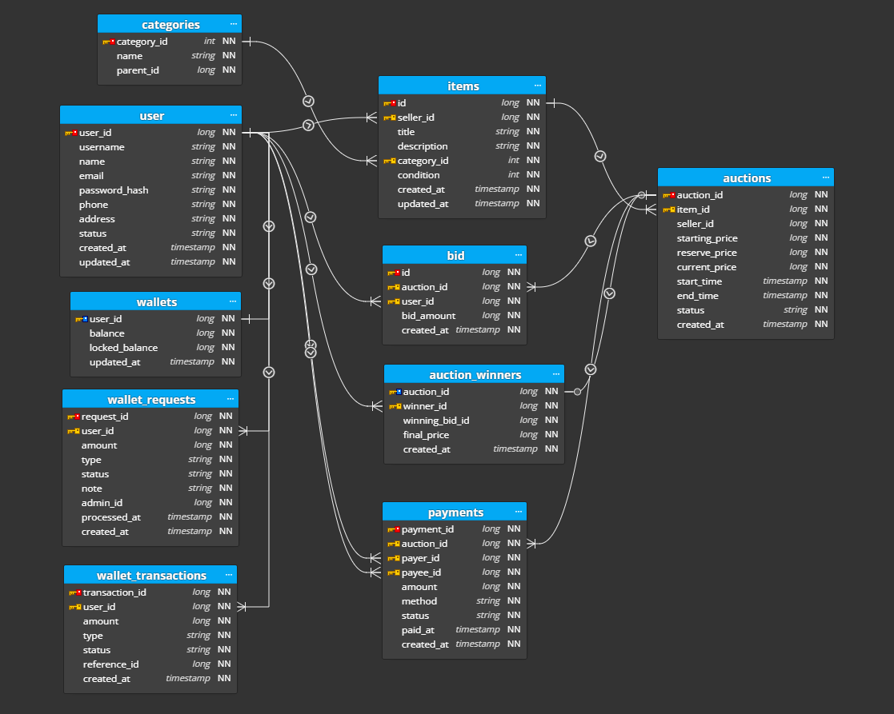

# Hammer 🔨
Realtime Online Auction System

## Architecture
- Backend: FastAPI
- Streaming: Kafka
- DB: PostgreSQL
- Frontend: React

## Features
- Real-time bidding
- Auction lifecycle
- Payment handling

## Ý nghĩa bảng/trường
1. Bảng users – quản lý người dùng
Lưu thông tin người dùng tham gia hệ thống (người bán + người mua)

Các trường
Field	Kiểu	Ý nghĩa
user_id	BIGINT	ID người dùng
username	STRING	tên đăng nhập
name	STRING	tên hiển thị
email	STRING	email
password_hash	STRING	mật khẩu đã hash
phone	STRING	số điện thoại
address	STRING	địa chỉ
status	STRING	trạng thái (active, banned...)
created_at	TIMESTAMP	thời điểm tạo
updated_at	TIMESTAMP	thời điểm cập nhật

2. Bảng categories – danh mục sản phẩm
Phân loại sản phẩm theo cây danh mục (tree)

Các trường
Field	Kiểu	Ý nghĩa
category_id	INT	ID danh mục
name	STRING	tên danh mục
parent_id	BIGINT	danh mục cha

3. Bảng items – sản phẩm
Lưu thông tin sản phẩm được đem ra đấu giá

Các trường
Field	Kiểu	Ý nghĩa
id	BIGINT	ID sản phẩm
seller_id	BIGINT	người bán
title	STRING	tiêu đề
description	STRING	mô tả
category_id	INT	danh mục
condition	INT	tình trạng sản phẩm
created_at	TIMESTAMP	thời điểm tạo
updated_at	TIMESTAMP	cập nhật

4. Bảng auctions – phiên đấu giá
Quản lý các phiên đấu giá của sản phẩm

Các trường
Field	Kiểu	Ý nghĩa
auction_id	BIGINT	ID phiên đấu giá
item_id	BIGINT	sản phẩm
seller_id	BIGINT	người bán
starting_price	BIGINT	giá khởi điểm
reserve_price	BIGINT	giá tối thiểu
current_price	BIGINT	giá hiện tại
start_time	TIMESTAMP	bắt đầu
end_time	TIMESTAMP	kết thúc
status	STRING	trạng thái
created_at	TIMESTAMP	tạo

💡 Ghi chú
current_price là giá cao nhất hiện tại (cache)
tránh query MAX từ bảng bid

5. Bảng bid – lượt trả giá
Lưu tất cả các lần đặt giá

Các trường
Field	Kiểu	Ý nghĩa
id	BIGINT	ID bid
auction_id	BIGINT	phiên đấu giá
user_id	BIGINT	người bid
bid_amount	BIGINT	số tiền
created_at	TIMESTAMP	thời điểm

6. Bảng auction_winners – kết quả đấu giá
Lưu snapshot người thắng cuộc

Các trường
Field	Kiểu	Ý nghĩa
auction_id	BIGINT	phiên đấu giá
winner_id	BIGINT	người thắng
winning_bid_id	BIGINT	bid thắng
final_price	BIGINT	giá cuối
created_at	TIMESTAMP	thời điểm xác định
💡 Ghi chú
tránh phải query lại từ bids
đảm bảo dữ liệu không thay đổi

7. Bảng payments – thanh toán
Quản lý giao dịch thanh toán sau khi đấu giá

Các trường
Field	Kiểu	Ý nghĩa
payment_id	BIGINT	ID thanh toán
auction_id	BIGINT	phiên đấu giá
payer_id	BIGINT	người trả
payee_id	BIGINT	người nhận
amount	BIGINT	số tiền
method	STRING	phương thức
status	STRING	trạng thái
paid_at	TIMESTAMP	thanh toán
created_at	TIMESTAMP	tạo
💡 Ghi chú
chỉ khi status = success mới thực sự chuyển tiền

8. Bảng wallets – ví tiền
Lưu số dư của người dùng

Các trường
Field	Kiểu	Ý nghĩa
user_id	BIGINT	người dùng
balance	BIGINT	tiền khả dụng
locked_balance	BIGINT	tiền đang bị giữ
updated_at	TIMESTAMP	cập nhật

9. Bảng wallet_requests – yêu cầu nạp/rút
Cho phép user yêu cầu nạp/rút tiền, admin duyệt

Các trường
Field	Kiểu	Ý nghĩa
request_id	BIGINT	ID request
user_id	BIGINT	người yêu cầu
amount	BIGINT	số tiền
type	STRING	deposit / withdraw
status	STRING	pending / approved / rejected
note	STRING	ghi chú
admin_id	BIGINT	admin xử lý
processed_at	TIMESTAMP	thời điểm xử lý
created_at	TIMESTAMP	tạo

10. Bảng wallet_transactions – lịch sử tiền
Lưu toàn bộ biến động tiền

Field	Kiểu	Ý nghĩa
transaction_id	BIGINT	ID giao dịch
user_id	BIGINT	người dùng
amount	BIGINT	số tiền (+/-)
type	STRING	loại giao dịch
status	STRING	trạng thái
reference_id	BIGINT	liên kết (payment, bid...)
created_at	TIMESTAMP	thời điểm

11. Luồng hoạt động tổng thể
User tạo item
 → tạo auction
 → user khác bid
 → cập nhật current_price

Auction kết thúc
 → xác định winner
 → tạo payment

Payment thành công
 → trừ tiền winner
 → cộng tiền seller
 → ghi wallet_transactions

## Document
1. Tổng quan hệ thống
🎯 Mục tiêu
Hệ thống Online Auction cho phép:
Người dùng đăng bán sản phẩm
Người khác tham gia đấu giá
Thanh toán qua ví nội bộ
Admin kiểm soát dòng tiền

🧱 Thành phần chính
User → Auction → Bid → Winner → Payment → Wallet

2. Luồng tổng thể
2.1. User tạo item
2.2. Tạo auction
2.3. User khác đặt bid
2.4. Auction kết thúc
2.5. Xác định winner
2.6. Winner thanh toán
2.7. Seller nhận tiền

3. User Flow
3.1 Đăng ký / đăng nhập
User → tạo account → login → nhận token

3.2 Nạp tiền
User → tạo wallet_request (deposit, pending)
→ Admin duyệt
→ tạo wallet_transaction (approved)
→ tăng balance

3.3 Rút tiền
User → tạo wallet_request (withdraw)
→ Admin duyệt
→ tạo wallet_transaction
→ giảm balance

4. Auction Flow
4.1 Tạo item
User → tạo item

4.2 Tạo auction
User → tạo auction
status = draft → active

4.3 Bắt đầu đấu giá
system check start_time → chuyển active

5. Bid Flow
Rule
bid phải > current_price
user phải đủ tiền
auction phải active

User gửi request bid

→ BEGIN TRANSACTION

🔄 Flow
5.1. lock auction row (FOR UPDATE)
5.2. check:
   - auction active
   - bid_amount > current_price
   - user đủ tiền

5.3. update:
   - auctions.current_price
   - insert bid

5.4. (optional) lock tiền user

→ COMMIT

Race condition
2 user bid cùng lúc:
User A: 100k
User B: 120k
=> Xử lý bằng: SELECT ... FOR UPDATE

6. Auction kết thúc
flow:
Scheduler / worker:
6.1. find auction hết hạn
6.2. lấy bid cao nhất
6.3. insert auction_winners
6.4. update auction.status = ended

7. Payment Flow
7.1 Winner thanh toán
Winner → pay
→ BEGIN
- check đủ tiền
- trừ balance winner
- cộng locked_balance seller (hoặc balance)
- insert payment (success)
- insert wallet_transactions
→ COMMIT

7.2 Fail payment
payment.status = failed
→ không thay đổi tiền

8. Wallet Logic
Balance vs Locked
Field	Ý nghĩa
balance	tiền có thể dùng
locked_balance	tiền bị giữ
🔥 Use case
Khi bid:
lock tiền (optional)
Khi thắng:
trừ tiền thật

9. Wallet Transactions
🎯 Vai trò
Lưu lịch sử tiền
Ví dụ:
+100k deposit
-50k withdraw
-1tr payment

10. Admin Flow
🟢 Duyệt nạp/rút
Admin → approve wallet_request
→ BEGIN
1. update request = approved
2. insert wallet_transaction
3. update wallet balance
→ COMMIT
⚠️ Tránh double approve
UPDATE wallet_requests
SET status = 'approved'
WHERE id = ?
AND status = 'pending'

11. Background Jobs
🔄 Scheduler
kết thúc auction
cleanup
🔄 Kafka (optional)
event bid
event payment

 backend/
│
├── app/
│   ├── main.py                # entry point (FastAPI)
│   │
│   ├── core/                  # config hệ thống
│   │   ├── config.py
│   │   ├── database.py
│   │   └── security.py
│   │
│   ├── models/                # ORM models (SQLAlchemy)
│   │   ├── user.py
│   │   ├── item.py
│   │   ├── auction.py
│   │   ├── bid.py
│   │   ├── wallet.py
│   │   └── payment.py
│   │
│   ├── schemas/               # Pydantic (request/response)
│   │   ├── user.py
│   │   ├── auction.py
│   │   ├── bid.py
│   │   └── wallet.py
│   │
│   ├── repositories/          # query DB (DAO layer)
│   │   ├── user_repo.py
│   │   ├── auction_repo.py
│   │   ├── bid_repo.py
│   │   └── wallet_repo.py
│   │
│   ├── services/              # business logic (quan trọng nhất)
│   │   ├── auth_service.py
│   │   ├── auction_service.py
│   │   ├── bid_service.py
│   │   ├── wallet_service.py
│   │   └── payment_service.py
│   │
│   ├── api/                   # route (controller)
│   │   ├── deps.py
│   │   ├── routes/
│   │   │   ├── auth.py
│   │   │   ├── users.py
│   │   │   ├── auctions.py
│   │   │   ├── bids.py
│   │   │   ├── wallets.py
│   │   │   └── payments.py
│   │
│   ├── db/                    # migration / seed
│   │   ├── base.py
│   │   └── session.py
│   │
│   ├── utils/
│   │   ├── time.py
│   │   └── helpers.py
│   │
│   └── workers/               # background jobs (Kafka consumer)
│       ├── bid_worker.py
│       └── payment_worker.py
│
├── tests/
│
├── requirements.txt
├── Dockerfile
└── .env